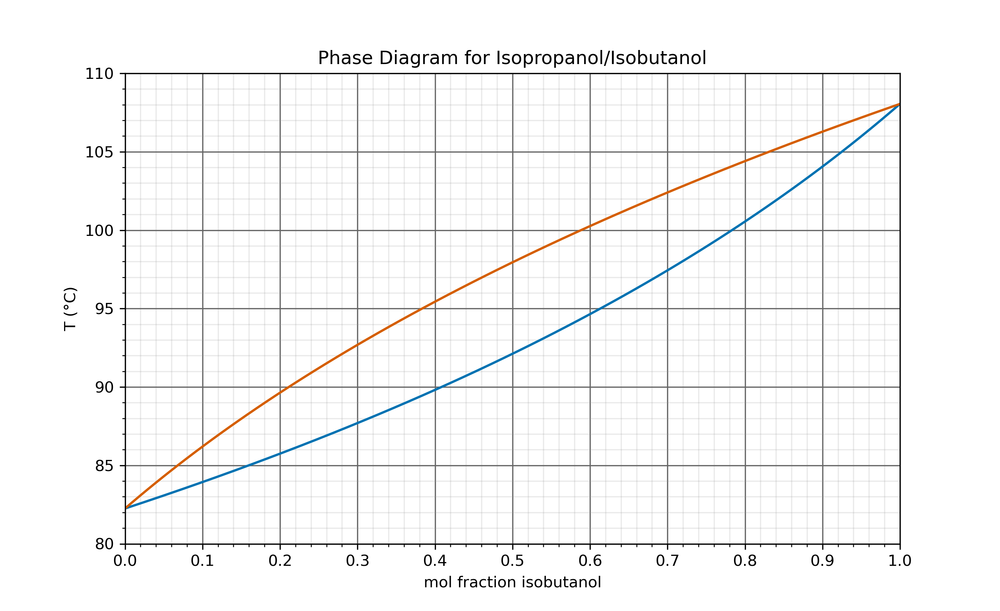
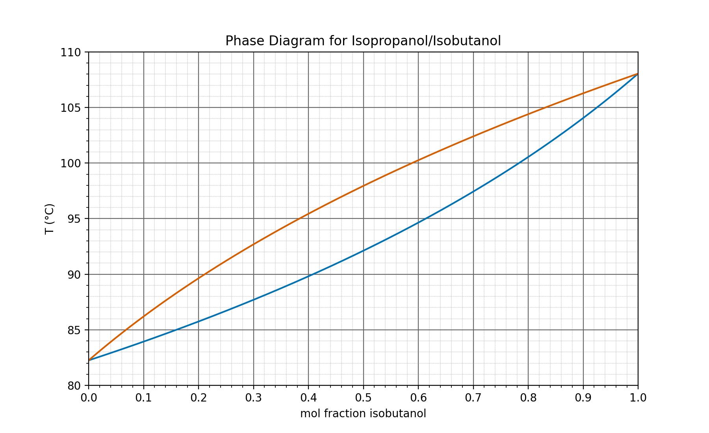

.. image:: https://mybinder.org/badge_logo.svg
 :target: https://mybinder.org/v2/gh/sametz/phase_diagram/main

A Jupyter notebook that generates a phase diagram
(T vs. mole fraction)
for isopropanol/isobutanol.

This is also a demonstration on
a) how to simulate phase diagrams for distillations,
and b) how to create animated GIFs with matplotlib.

The Clausius-Clapeyron equation is used to simulate the ideal behavior
for a two-component mixture of two miscible liquids.
If you edit the boiling points and heats of formation,
you can simulate data for other mixtures besides isopropanol/isobutanol.

The code will save a .png plot first:

and then an animated version:

The default gif speed is set at 1 frame per 5 s.
